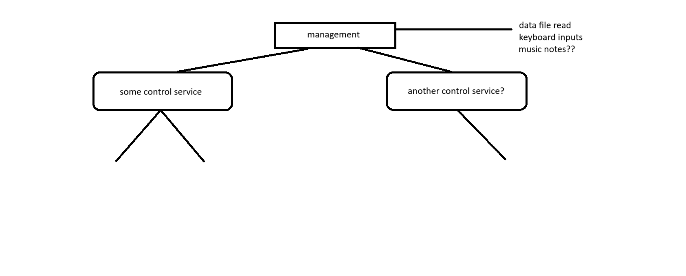

# DDS Project
###### Author: Ayhan Eyikan

This is a simple experiment at creating a network of connected services which
pass information between each other in order to carry out a more complex task.

No specific function has yet been decided on for the task to be completed:
instead work thus far has been on building out and testing the viability of the
setup of these services.

The following diagram provides an overview of the current vision for the
functionality of the completed DDS system. There are 3 main goals:

1. Some top level management service which reads/takes in input and oversees
other services in processing that data
2. Some control service which utilizes commands sent by the management service
to carry out processing and provide some sort of tangible output, the nature of
which has not yet been determined
3. Another service which is initialized by the management service and
communicates with the control service to carry out some additional supplemental
processing



---

The ultimate goal is to orchestrate the completion of a complex task as is
defined in some format within an input file which is created prior to execution.
Ideally, execution may also include the possibility of failures which should be
handled gracefully and sensibly.

## Running the Project

For the time being, each service is compiled as its own binary and must be run
manually on separate terminals. I hope to utilize something simpler in the
future to make it a one-command process.

Open a terminal and run the subscriber binary using
```bash
cargo run --bin sub
```

Open a second terminal and run the driver binary using
```bash
cargo run --bin driver
```